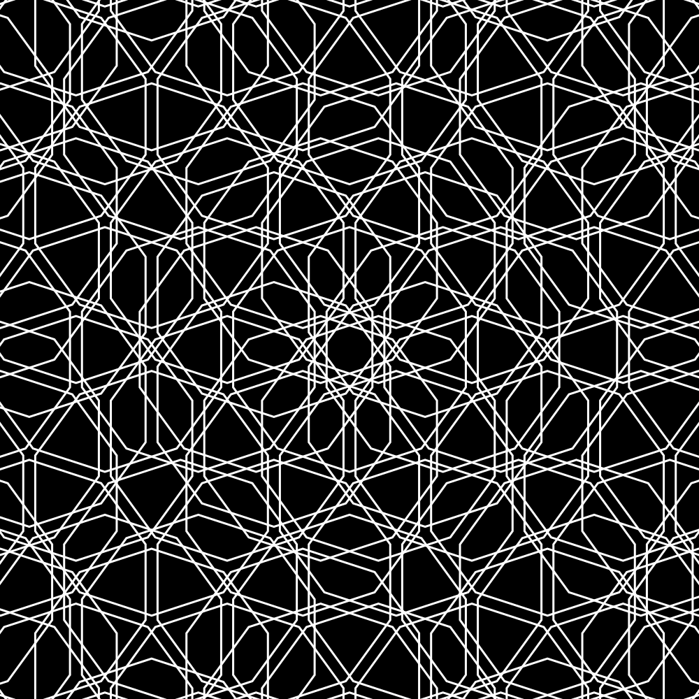
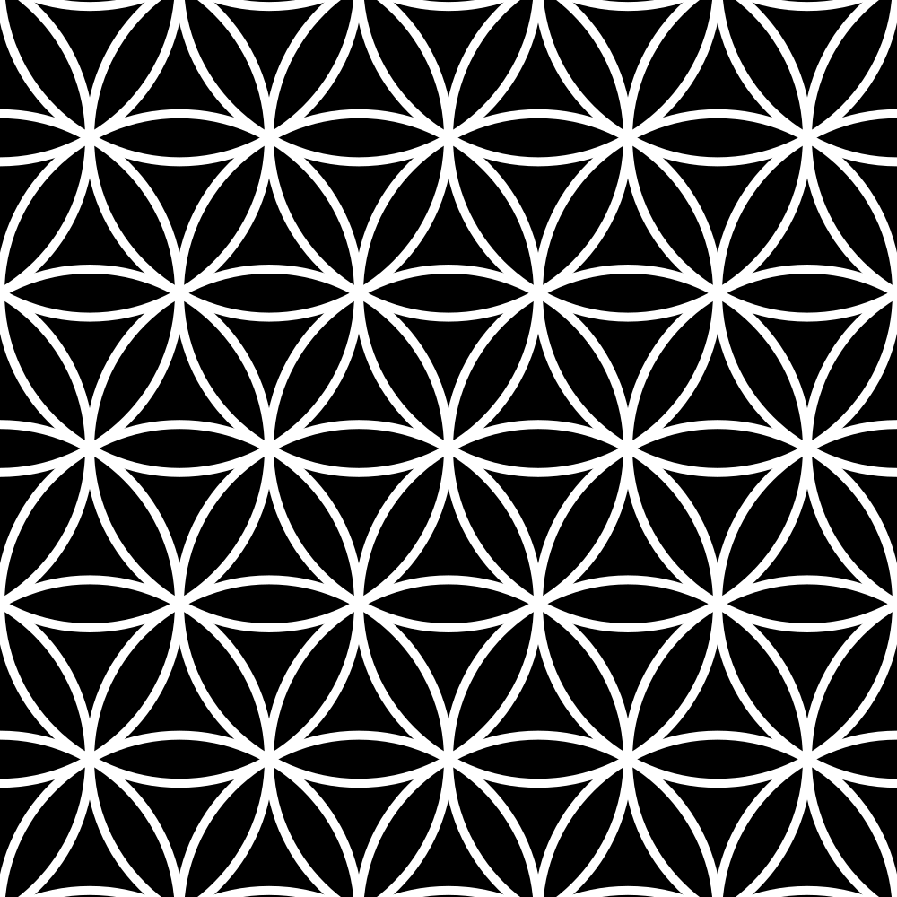

# Mirror

Experiments with repeating geometric patterns, inspired by "Islamic Patterns: An Analytical and Cosmological Approach" by Keith Critchlow. Uses the `cairo2` API for vector graphics.

## Examples

  
  

  
  

You can build the examples yourself with `dune build -- examples`.
